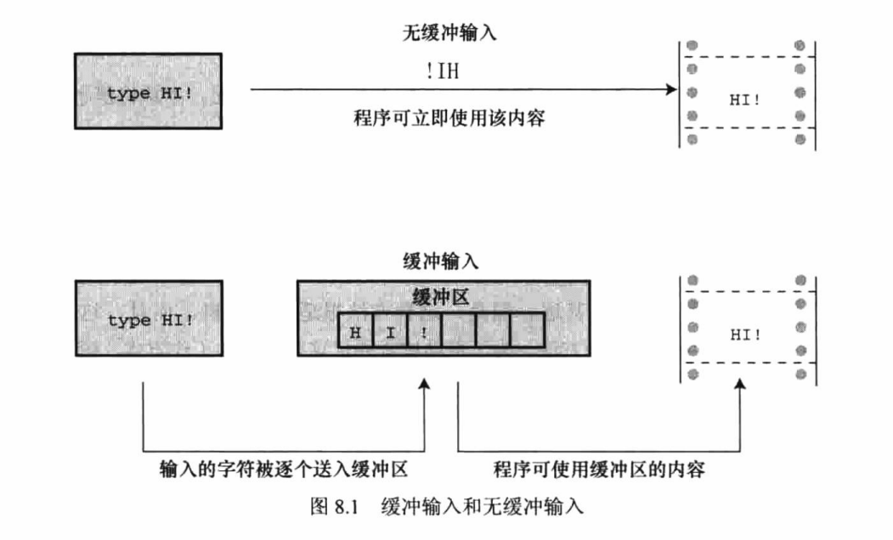

## Character Input/Output and Input Validation

### 缓冲区
**无缓冲(直接)输入**: 正在等待的程序可立即使用输入的字符。

**缓冲输入**: 用户输入的字符被收集并储存在一个被称为缓冲区(buffer)的临时存储区，按下Enter键后，程序才可使用用户输入的字符。
缓冲区的大小取决于系统，常见的大小是512字节和4096字节。

**完全缓冲输入**: 当缓冲区被填满时才刷新缓冲区(内容被发送至目的地)，通常出现在文件输入中。

**行缓冲输入**: 在出现换行符时刷新缓冲区。键盘输入通常是行缓冲输入，所以在按下Enter键后才刷新缓冲区。
```text
      无缓冲(直接)输入
    /
输入             完全缓冲输入
    \         /
      缓冲输入 
              \
                行缓冲输入
```


### 重定向
#### 输入重定向 <
```shell
cmake-build-debug/c_primer_plus < /home/Mike/test.txt
```

#### 输出重定向 >
```shell
cmake-build-debug/c_primer_plus > /home/Mike/test.txt
```

#### 组合重定向
注意：在一条命令中，输入文件名和输出文件名不能相同。
```shell
cmake-build-debug/c_primer_plus < /home/Mike/test.txt > /home/Mike/test2.txt
```
使用原则：
1. 重定向运算符连接一个可执行程序（包括标准操作系统命令）和一个数据文件，而不是2个数据文件或2个可执行程序。
2. 使用重定向运算符不能读取多个文件的输入，也不能把输出定向到多个文件。
3. 通常，文件名和运算符之间的空格不是必须的，除非偶尔在UNIX shell、Linux shell或Windows命令行提示模式中使用的有特殊含义的字符。

#### 输出重定向 >>
该运算符可以把数据添加到现有文件的末尾，并不会擦除现有数据。